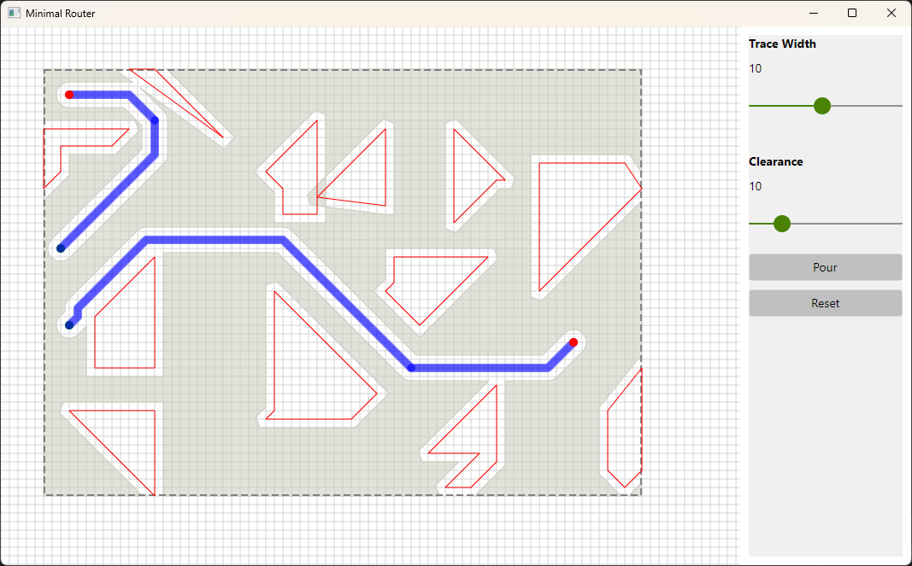

# MinimalRouter

[English](README.md)


一款用于探索 PCB（印制电路板）绘图软件中关键算法的最小化演示程序。



项目目标：研究并演示 PCB 布线/布图中常见的算法与要点，包括路径搜索（A*）、碰撞检测、走线宽度/间距处理、直角倒角（chamfer）以及布线后与障碍物/走线差集（pour / copper pour）。

此项目是学习和试验算法概念的演示项目，没有区分世界坐标系和绘图的坐标系。


---

## 功能亮点

- 交互式 UI（基于 .NET Avalonia）：在画布上放置随机障碍，拖拽布线并可以多段确认路线。
- A* 网格搜索：8 个方向（包含对角），带方向切换惩罚（Turn Penalty）以降低不必要拐角。
- 碰撞检测：支持任意多边形障碍（Obstacle）、路径（Trace）的碰撞检测（外接边界 + 边-边距离测试）。
- 走线 & 间距管理：基于走线宽度和全局间距（Clearance）做边界扩张检测。
- 直角倒角（Chamfer）：自动在 90° 拐角处尝试用 45° 倒角替换，以减少尖角并改善走线可制造性。
- Copper Pour（倒铜/差集）：通过 Clipper2 对板边界/障碍/走线做差集，展示可倒铜区域（并考虑走线半宽和间距的膨胀）。
- 矢量化加速：示例中包含向量化批量距离计算，以便在大数组上减小开销。

---

## 项目结构（重要文件概要）

- `Program.cs`：Avalonia 应用程序入口。
- `MainWindow.axaml` / `MainWindow.axaml.cs`：用户界面与交互逻辑，包含随机障碍生成、鼠标事件（绘制/确认），以及倒铜演示。
- `Controls/DrawingCanvas.cs`：画布绘制支持。
- `Routing/Router.cs`：核心布线路由器，包含 A* 实现、网格邻居、简化与倒角逻辑。
- `Routing/CollisionDetector.cs`：碰撞检测实现，包括多边形、矩形和线段间最短距离的 robust 方法。
- `Routing/Obstacle.cs`：障碍物多边形数据结构。
- `Routing/Trace.cs`、`Routing/Segment.cs`：走线/线段模型。
- `Models/Point.cs`：自定义简化的 `Point` 结构。

---

## 设计与实现细节（算法点）

1. 路径搜索（Router）
   - 使用 A*（启发函数为欧氏距离）在离散化的网格上进行搜索（step = 10 像素），每个点的邻居包含 8 个方向（4 正交 + 4 对角）。
   - 为减少不必要拐弯，引入 TurnPenalty（更偏好直线或少转弯）以影响 gScore。
   - 搜索范围会限制在起点/终点附近的一个 MaxSearchRange 半径内，以防止全局爆炸式遍历。
   - 路径后处理：去除共线中间点（Simplify），并尝试将 90° 转角替换为倒角（ApplyChamfers）处理，倒角需要在替换后确认没有碰撞再应用。

2. 碰撞检测（CollisionDetector）
   - 对每个障碍物，使用其包围矩形做快速裁剪（Inflated by clearance + width/2），若包围矩形有交集则进一步使用多边形/边-边距离来判断碰撞。
   - 对已有走线（Trace），以走线半宽 + 间距（clearance）的合成距离作为最小允许距离，若两线段间距离低于此值即判为碰撞，且会忽略共端点（允许连接）。
   - 多边形点内判断采用射线法；线段-线段最短距离使用经典的几何算法（来自 `GeomAlgorithms`）以提高稳健性。

3. Copper Pour（倒铜）
   - 使用 Clipper2 库：先构建 Subject（板边界），再将 Obstacles + Traces（经过膨胀：trace 的半宽 + clearance）作为 Clip，执行 Difference 得到可填充区域（并渲染）。

4. 性能友好措施
   - 在一些距离批量计算中尝试使用 System.Numerics.Vector 来做 SIMD 加速（在矩阵较大且硬件支持的情况下）。
   - 搜索区域裁剪并设定最大步限制（maxSteps）以防止无限循环或过长运行时间。

---

## 快速开始（在 Windows / PowerShell 下）

前提：已安装 .NET SDK（建议 .NET 10 / 11），并连接 Internet 以还原 NuGet 包。

构建并运行：

```pwsh
dotnet restore
dotnet build -c Debug
dotnet run --project MinimalRouter.csproj
```

应用将启动一个窗口：
- 左键单击开始布线；移动鼠标动态显示候选走线；再点击以确认一段走线；双击结束布线。
- 右键取消当前布线状态并清除走线。
- 使用“Width”滑块调整走线宽度，使用 “Clearance” 滑块调整全局间距（Clearance），然后点击 “Pour” 按钮执行铺铜操作（板边界减去障碍与走线的区域）。

## 交互说明与用户行为

- 点击画布首次放置 **起点**（绿点），随后移动并单击以添加分段的布线。双击以结束并提交当前布线轨迹。右键撤销/取消。
- 当你确认一段走线后，程序会把其加入静态 Trace 列表，之后的布线会把该静态走线考虑在碰撞检测中（但会允许连接端点）。
- 障碍物是随机生成的多边形，只为演示避障与倒铜逻辑。


## 许可与贡献

该仓库为视频演示用途。
归于 Public Domain。

作者：[李维](mailto:oldrev@gmail.com)（其实主要是 Copilot）